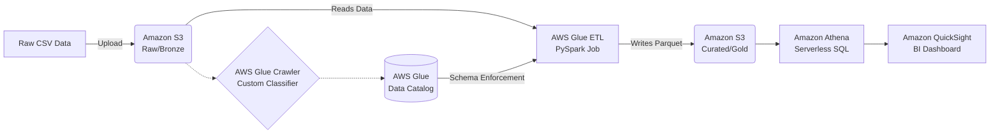

  <h1>🌊 LedgerLake: AWS Serverless Data Pipeline</h1>
  
<i>An end-to-end, serverless data engineering architecture for credit risk analysis built entirely on AWS.</i>

  
  
  
  

---

## 🎥 Project Demo
[Click here to watch the Demo Video](https://lnkd.in/p/gfzgYva9)

---

## 📖 Overview
**LedgerLake** is a fully automated, serverless batch ETL pipeline designed to process messy historical loan applicant data and transform it into an interactive Business Intelligence dashboard. 

This project demonstrates the implementation of a **Medallion Data Architecture (Bronze/Silver/Gold)** using highly optimized, columnar Parquet files, reducing AWS storage and query costs to fractions of a penny.

## 🏗️ Architecture
The pipeline requires zero provisioned infrastructure and scales automatically on demand.

## 🛠️ Tech Stack & Key Services
* **Amazon S3**: Acts as the central Data Lake, utilizing customized S3 Lifecycle rules to automate the cleanup of temporary Athena query results and control costs.
* **AWS Glue (Data Catalog & Crawlers)**: Automates schema inference. Built with Custom CSV Classifiers to override default inference behaviors and handle edge-case header metadata.
* **AWS Glue (PySpark ETL)**: Distributed data processing. Script utilizes PySpark `resolveChoice` methods to elegantly handle `Struct` data type mismatches caused by messy CSV headers, casting them to Doubles.
* **Amazon Athena**: Serverless interactive querying engine used to validate the Parquet output.
* **Amazon QuickSight**: Enterprise BI layer connected to Athena via strictly scoped IAM Service Roles.

## 🧠 Technical Highlights
* **Schema Evolution Handling**: Handled complex Glue `Choice` types by dynamically casting inferred string headers to `null` floats during the PySpark transformation phase.
* **Cost Optimization**: Replaced default AWS behaviors with cost-saving S3 Lifecycle rules (auto-expiring Athena outputs after 7 days) and utilized minimum required Glue worker nodes (`G.1X`).
* **Strict IAM Security**: Configured isolated IAM roles for Glue execution, and manually scoped QuickSight permissions to only allow `s3:PutObject` on specific Athena-Workgroup buckets, preventing over-privileged service access.

---

## 🚀 Try It Yourself!
Want to build this exact architecture in your own AWS account? 

I have written a highly detailed, click-by-click walkthrough guide that will take you from an empty AWS account to a fully working dashboard, complete with cost-saving warnings and troubleshooting tips.

👉 **[Click here to view the Step-by-Step Guide](aws-ledgerlake-stepbystep-guide.md)** 👈

---

  <i>Built with ☕ and AWS by [Your Name]</i>

